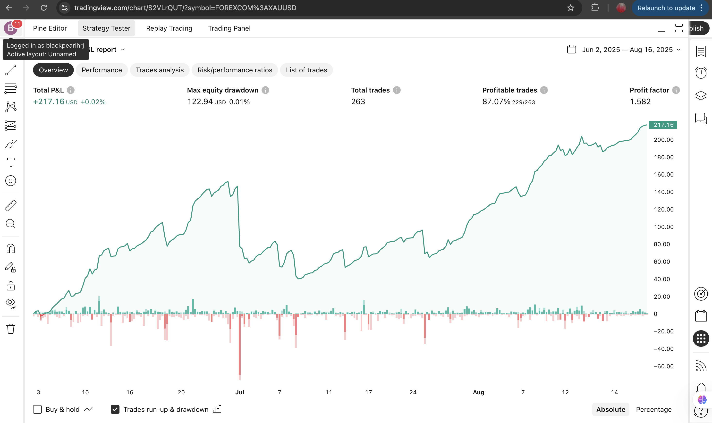
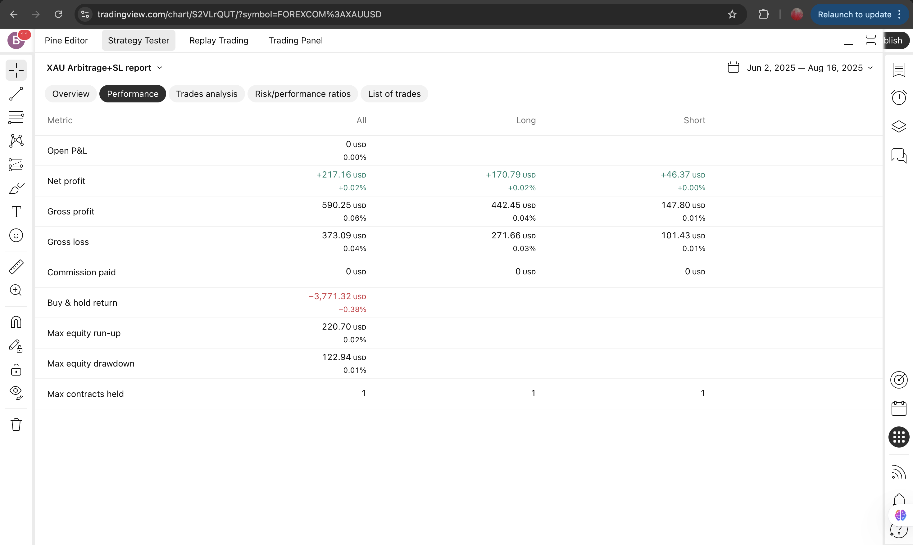
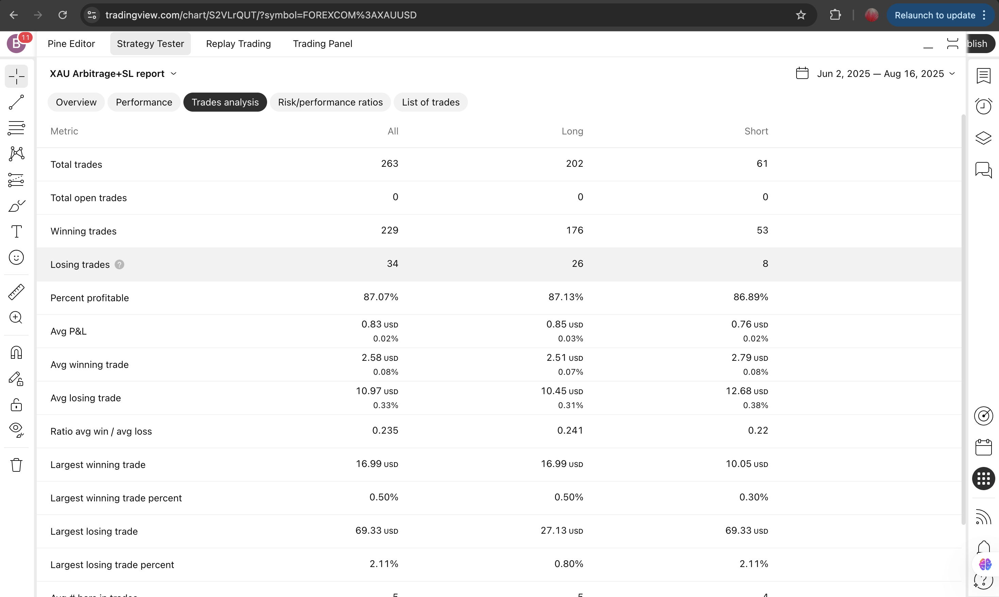
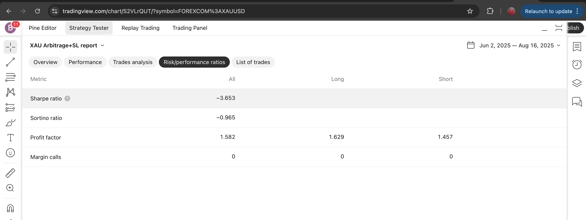

# XAU/USD Enhanced Arbitrage Strategy

This repository contains the **XAU/USD Enhanced Arbitrage Strategy** script written in Pine Script. The strategy leverages advanced session detection, volatility & trend filters, and cross-market analysis to optimize gold (XAU/USD) trading across Asian, London, and New York sessions.

---

## Overview

Below are example screenshots showcasing the performance and analysis of the strategy on real data.

### 1. Strategy Overview Screenshot

- **Total PnL:** *(See screenshot)*
- **Max Equity Drawdown:** *(See screenshot)*
- **Total Trades:** 263
- **Profitable Trades:** 87%
- **Profit Factor (Gross Profit / Gross Loss):** 1.582

---

### 2. Performance Summary Screenshot

This section shows the overall summary including:

- **Net Profit**
- **Gross Profit**
- **Gross Loss**

---

### 3. Trade Analysis Screenshot

Detailed trade statistics:

- **Total Trades:** 263
- **Total Open Trades:** 0
- **Winning Trades:** 229
- **Losing Trades:** 34
- **Percent Profitable:** 87.07%

---

### 4. Risk/Performance Ratio Screenshot

This screenshot highlights risk-adjusted metrics, such as:

- **Profit Factor** (and other risk metrics as shown)

---

## How to Use

1. Copy the Pine Script (`.pine` file) to your TradingView Pine Editor.
2. Save and add the strategy to your desired chart (recommended for XAU/USD on 15m–1H timeframes).
3. Attach your own screenshots of performance from your backtesting results for transparency and personalized analysis.

---

## Disclaimer

This strategy is **for educational and research purposes only**. Performance results are based on historical data and do not guarantee future returns. Please trade responsibly and adjust risk settings according to your requirements.

---

## Screenshots

Add your screenshots in the appropriate sections above for best results and easier tracking of strategy performance. 

---

**Happy Trading!**
